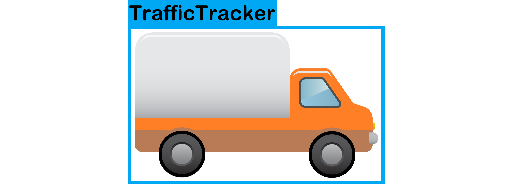

# A street traffic heatmap generator built with YOLOv5 and Deep SORT

[![Contributors][contributors-shield]][contributors-url]
[![Issues][issues-shield]][issues-url]
[![CircleCI][circleci-url]][circleci-shield]
[![MIT License][license-shield]][license-url]

<div align="center">A street traffic counter that aligns with the values of the Beasley Neighbourhood providing efficient and ethical modelling of how people engage and interact within a given public space.
</div>

## Table of Contents
1. [About the Project](#about-the-project)\
    a. [Built With](#built-with)
3. [Getting Started](#getting-started)\
    a. [Prerequisites](#prerequisites)\
    b. [Installation](#installation)
4. [Usage](#usage)
5. [License](#license)

# About The Project
This project was designed to act as a "traffic camera" for tracking vehicles and pedestrians to generate metrics based on the data.
The idea is to be able to use a small hardware setup to run the models while having the data accessible from a website in the cloud.
The hardware being used here is the Nvidia Jetson Nano.
One of the main goals of this project is to provide an ethical way to count vehicle and pedestrian traffic.
Many of the systems that exist do not put an emphasis on privacy and that is why it is one of our main goals.

## Built With
- [YOLOv5](https://github.com/ultralytics/yolov5)
- [Deep SORT](https://github.com/nwojke/deep_sort)

# Getting Started
Coming soon...
## Prerequisites
## Installation

# Usage
Running the tracker:
```
python deep_sort.py --source 0  # webcam
                             file.mp4  # video
                             path/to/file.mp4
```

Running the container on Jetson Nano:
```
sudo docker run -it --rm --runtime nvidia --network host traffictracker:latest
```
Running development container:
```
sudo docker run -it --rm --runtime nvidia -v /path/to/TrafficTracker:/TrafficTracker traffictracker:dev
```

# License
Distributed under the MIT License. See `LICENSE` for more information.

# Acknowledgements
- [PythonLessons TensorFlow-2.x-YOLOv3](https://github.com/pythonlessons/TensorFlow-2.x-YOLOv3)


[contributors-shield]: https://img.shields.io/github/contributors/McMasterAI/TrafficTracker.svg
[contributors-url]: https://github.com/McMasterAI/TrafficTracker/graphs/contributors
[issues-shield]: https://img.shields.io/github/issues/McMasterAI/TrafficTracker.svg
[issues-url]: https://github.com/McMasterAI/TrafficTracker/issues
[circleci-url]: https://circleci.com/gh/McMasterAI/TrafficTracker.svg?style=shield
[circleci-shield]: https://circleci.com/gh/McMasterAI/TrafficTracker
[license-shield]: https://img.shields.io/github/license/McMasterAI/TrafficTracker.svg
[license-url]: https://github.com/McMasterAI/TrafficTracker/blob/master/LICENSE.txt
